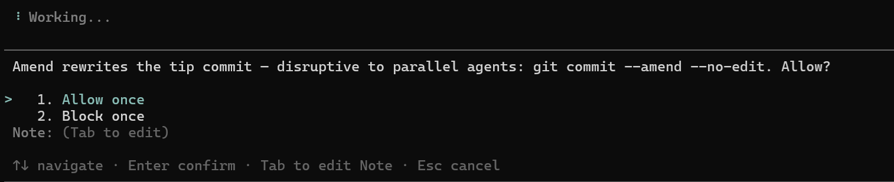

# avtc-pi-ui-components

A dialog coordinator for pi extensions that prevents dialogs from rendering over each other, plus a select-with-note component that wires subagent routing and notification.

## Features

Two things:

1. **The dialog coordinator** — serializes dialogs so only one shows at a time; when multiple extensions or async processes fire dialogs simultaneously, they never render over each other and bury the one beneath. Exported (and emitted via `dialog-coordinator:ready`) so any extension's custom dialogs (`ctx.ui.custom(...)`) queue against the same shared queue.

2. **`showSelectWithNote(...)`** — a ready-made selection dialog with an explanatory note above the options that uses the coordinator and additionally wires **subagent routing** (renders in the root UI when forwarded from a subagent, if `avtc-pi-subagent-ui-bridge` is installed) and **attention notification** (fires if `avtc-pi-notification` is installed, no-op otherwise). Call one function, get coordination + routing + notification for free.

   

## Installation

```bash
pi install npm:avtc-pi-ui-components
```

## When to load this extension

Load ui-components as a companion extension **only if your extension shows dialogs
that can be triggered asynchronously** — from an agent tool call, a background
timer/pipeline, or any path that isn't a direct user command. Those dialogs can
fire while another dialog is already open, so they need the coordinator to
**prevent them from rendering over each other**.

If your extension's dialogs are all **user-command-only** (e.g. a `/settings`
modal opened on demand), you don't need to load it: while such a modal is open
the agent isn't running and nothing interrupts it, so coordination is
unnecessary.

To load it as a companion:

```jsonc
{
  "dependencies": { "avtc-pi-ui-components": "^1.0.0" },
  "pi": {
    "extensions": ["./index.ts", "node_modules/avtc-pi-ui-components/index.ts"]
  }
}
```

The coordinator is a shared singleton guarded against double-registration, so
it's safe for several extensions to load it — whichever loads first wires it,
the rest no-op.

## Usage

### `showSelectWithNote`

```ts
import { showSelectWithNote, type SelectWithNoteOption } from "avtc-pi-ui-components";

const options: SelectWithNoteOption[] = [
  { label: "Allow once", value: "allow" },
  { label: "Block once", value: "block" },
];

// On timeout the dialog auto-resolves to defaultOption (options[1] here).
// Pass `undefined` to wait for the human indefinitely.
const result = await showSelectWithNote(
  ctx, // the ExtensionContext / ctx passed to your handler
  "git checkout would disrupt parallel work. Allow?",
  options,
  options[1], // defaultOption — highlighted + used on timeout
  "my-extension", // source — labels the notification if one fires
  15 * 60_000, // timeoutMs — auto-resolve after 15 min
);

// result is { value, note } on a choice (or the default on timeout), or null if dismissed
if (result?.value === "allow") {
  /* ... */
}
```

### The dialog coordinator for custom dialogs

Extensions with their own dialogs queue them against the same shared coordinator. Vendor the shipped snippet, register it, then wrap any blocking `ctx.ui.*` call:

```ts
// 1. Vendor src/snippets/canonical/subscribe-to-dialog-coordinator.ts into your extension
import {
  subscribeToDialogCoordinator,
  withCoordinator,
} from "./snippets/vendored/subscribe-to-dialog-coordinator.js";

export default function (pi: ExtensionAPI) {
  subscribeToDialogCoordinator(pi);
}

// 2. Wrap a custom dialog — queued if another dialog is open, shown immediately otherwise
const choice = await withCoordinator(() => ctx.ui.custom(myDialogComponent));
```

If `avtc-pi-ui-components` isn't installed, `withCoordinator` is a transparent pass-through.

## Public API

| Export | Purpose |
| --- | --- |
| `showSelectWithNote(ctx, title, options, defaultOption?, source?, timeoutMs?)` | The selection-with-note dialog (auto-coordinated + auto-attention). Returns `{ value, note }` or `null` if dismissed. |
| `SelectWithNoteOption`, `SelectWithNoteResult` | Types: `{ label, value }` options; `{ value, note }` result. |
| `DialogCoordinator`, `dialogCoordinator` | The shared queue + a singleton, for extensions building their **own** dialogs (`enqueueOrShow`). |

## How It Works

On `session_start`, the extension emits `dialog-coordinator:ready` and registers its subagent-bridge content type, so forwarded `select-with-note` requests render in the root UI. Consumer extensions just call `showSelectWithNote(...)` — no event subscription or wiring needed.

## Full suite

Check out the full suite of related extensions, [avtc-pi](https://github.com/avtc/avtc-pi) — deterministic feature development, subagent delegation, working-memory, behavioral learning, parallel-work guardrails, durable decisions, notifications, and more.

Developed with [Z.ai](https://z.ai/subscribe?ic=N5IV4LLOOV) — get 10% off your subscription via this referral link.

## License

MIT
